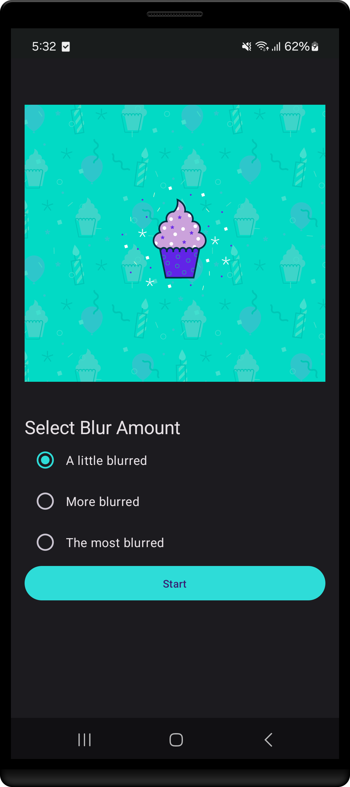

<h1 align="center" >  Blur-O-Matic    [ ᴀɴᴅʀᴏɪᴅ ♾ ᴅᴇᴍᴏ ᴘʀᴏᴊᴇᴄᴛ ]</h1>

## ɪ  ⁃  ᴘʀᴏᴊᴇᴄᴛ ɪɴꜰᴏ

Blur-O-Matic, an app that blurs photos and saves the results to a file. Was that the Loch Ness monster or a toy submarine? With Blur-O-Matic, no one will ever know!
 

⁃ ᴄᴏɴᴛᴇɴᴛꜱ ⁃  
[ᴜꜱᴇʀ ꜰᴇᴀᴛᴜʀᴇꜱ](#ɪɪ--ᴡʜᴀᴛ-ᴜꜱᴇʀꜱ-ᴄᴀɴ-ᴇxᴘᴇᴄᴛ)
| [ᴀᴘᴘ ꜱᴄʀᴇᴇɴꜱ](#ɪɪɪ--ᴠɪꜱᴜᴀʟ-ᴛᴏᴜʀ-ᴏꜰ-ᴛʜᴇ-ᴀᴘᴘ-ꜱᴄʀᴇᴇɴꜱ)
| [ᴘʀᴏᴊᴇᴄᴛ ʙʀᴀɴᴄʜᴇꜱ](#ɪᴠ--ᴘʀᴏᴊᴇᴄᴛ-ʙʀᴀɴᴄʜᴇꜱ)
| [ᴅᴇᴠ ꜰᴇᴀᴛᴜʀᴇꜱ](#ᴠ--ʙᴇʜɪɴᴅ-ᴛʜᴇ-ᴄᴏᴅᴇ-ᴅᴇᴠ-ꜰᴇᴀᴛᴜʀᴇꜱ)
| [ᴘʀᴏᴊᴇᴄᴛ ɴᴏᴛᴇꜱ](#ᴠɪ--ᴘʀᴏᴊᴇᴄᴛ-ɴᴏᴛᴇꜱ)

 
 

 
 

 

