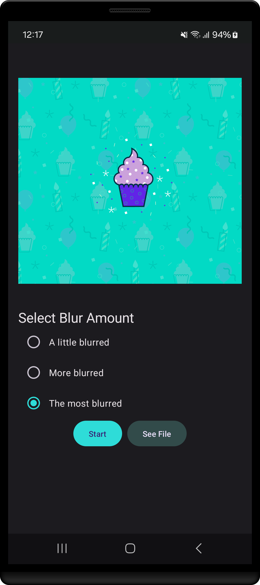

<h1 align="center" >  Blur-O-Matic  <br> [ ᴀɴᴅʀᴏɪᴅ ♾ ᴅᴇᴍᴏ ᴘʀᴏᴊᴇᴄᴛ ]</h1>

## ɪ  ⁃  ᴘʀᴏᴊᴇᴄᴛ ɪɴꜰᴏ

Blur-O-Matic, an app that blurs photos and saves the results to a file. Was that the Loch Ness monster or a toy submarine? With Blur-O-Matic, no one will ever know!
<br>

<div align="center">

⁃ ᴄᴏɴᴛᴇɴᴛꜱ ⁃  
[ᴜꜱᴇʀ ꜰᴇᴀᴛᴜʀᴇꜱ](#ɪɪ--ᴡʜᴀᴛ-ᴜꜱᴇʀꜱ-ᴄᴀɴ-ᴇxᴘᴇᴄᴛ)
| [ᴀᴘᴘ ꜱᴄʀᴇᴇɴꜱ](#ɪɪɪ--ᴠɪꜱᴜᴀʟ-ᴛᴏᴜʀ-ᴏꜰ-ᴛʜᴇ-ᴀᴘᴘ-ꜱᴄʀᴇᴇɴꜱ)
| [ᴘʀᴏᴊᴇᴄᴛ ʙʀᴀɴᴄʜᴇꜱ](#ɪᴠ--ᴘʀᴏᴊᴇᴄᴛ-ʙʀᴀɴᴄʜᴇꜱ)
| [ᴅᴇᴠ ꜰᴇᴀᴛᴜʀᴇꜱ](#ᴠ--ʙᴇʜɪɴᴅ-ᴛʜᴇ-ᴄᴏᴅᴇ-ᴅᴇᴠ-ꜰᴇᴀᴛᴜʀᴇꜱ)
| [ᴘʀᴏᴊᴇᴄᴛ ɴᴏᴛᴇꜱ](#ᴠɪ--ᴘʀᴏᴊᴇᴄᴛ-ɴᴏᴛᴇꜱ)

<br>
<br>

[](#)
[](#)

[](#)
[](#)
[](#)
[](#)

<br>
<br>


<br>

</div>

## ɪɪ ⁃ ᴡʜᴀᴛ ᴜꜱᴇʀꜱ ᴄᴀɴ ᴇxᴘᴇᴄᴛ

### ⭓ Features


1. **Blur Intensity Adjustment:** Users can customize the intensity of the blur effect, allowing for light blurring to complete obscurity.


2.  **Offline Functionality:** Users can blur images without needing an internet connection.


3.  **User-Friendly Interface:** A simple and intuitive interface that makes it easy for users to navigate and use the app's features.


##
### ⭓ Requirements
- Android 7.0 and Above
- Min SDK version 24


##
### ⭓ Permissions
- N/A

<hr>

## ɪɪɪ ⁃ ᴠɪꜱᴜᴀʟ ᴛᴏᴜʀ ᴏꜰ ᴛʜᴇ ᴀᴘᴘ: ꜱᴄʀᴇᴇɴꜱ

<p align="center">


</p>


#
<div align="center">


  <br>

<kbd>[&nbsp; ⮝ &nbsp;  BACK TO TOP  &nbsp;&nbsp;&nbsp;](#ɪ----ᴘʀᴏᴊᴇᴄᴛ-ɪɴꜰᴏ) </kbd>
</div>

#
## ɪᴠ ⁃ ᴘʀᴏᴊᴇᴄᴛ ʙʀᴀɴᴄʜᴇꜱ

<!-- Main / Master / Production Branch -->

> <samp> **PRODUCTION BRANCH :**  </samp>  
> Stable code for deployment  
> ➲ [main][branch-main]

> <samp> **STAGING BRANCH :**  </samp>  
> `FLOW | Staging → Production`  
> For pre-release testing, which ensures that the code is stable, bug-free, and ready for deployment.  
> ➲ [staging][branch-staging]

> <samp> **DEVELOPMENT BRANCH :**  </samp>  
> `FLOW | Development → Release → Staging → Production`  
> Active codebase for ongoing development efforts  (New features, bug fixes, and improvements..)  
> ➲ [development][branch-development]


> <samp> **FEATURE BRANCHES :** N/A  </samp>  
> `FLOW | Feature → Development → Release → Staging → Production`  
<!-- 
> <samp> **FEATURE BRANCHES :**  </samp>  
> For Isolated feature development (Ensures changes are tested and reviewed before merging into the main workflow)  
>   
> feature/  
> ➲ dark-theme  
> ➲ offline-db-impl
-->


> <samp> **RELEASE BRANCHES :** N/A  </samp>  
> `FLOW | Release → Staging → Production`  
<!-- 
> <samp> **RELEASE BRANCHES :**  </samp>  
> Prepares the code for final testing and deployment in a new version release.
>   
> release/  
> ➲ version-number
-->


> <samp> **HOTFIX BRANCHES :** N/A  </samp>  
> `FLOW | Hotfix → Staging → Production`  
<!-- 
> <samp> **HOTFIX BRANCHES :**  </samp>  
> Handles critical fixes in production that need immediate resolution.
>   
> hotfix/  
> ➲ main-screen-crash 
-->


> <samp> **BUGFIX BRANCHES :** N/A  </samp>  
> `FLOW | Bugfix → Development → Release → Staging → Production` 
<!-- 
> <samp> **BUGFIX BRANCHES :**  </samp>  
> Addresses specific bugs identified during development and testing.
>   
> bugfix/  
> ➲ main-screen-error
-->

<!-- 
> <samp> **EXPERIMENTAL BRANCHES :** N/A  </samp>  

> <samp> **EXPERIMENTAL BRANCHES :**  </samp>  
> Facilitates trial and error to test new ideas and concepts.
>   
> experiment/  
> ➲ main-screen-change-colours
-->
<!-- Experimental → Feature → Development → Release → Staging → Main/Production   -->


[branch-main]:  https://github.com/dizzcode/inventory-android-test-app/tree/main
[branch-development]:  https://github.com/dizzcode/inventory-android-test-app/tree/development
[branch-staging]:  https://github.com/dizzcode/inventory-android-test-app/tree/staging

[branch-feature-NAME]:  https://github.com/dizzcode/inventory-android-test-app/tree/staging

[branch-hotfix-NAME]:  https://github.com/dizzcode/inventory-android-test-app/tree/staging

[branch-bugfix-NAME]:  https://github.com/dizzcode/inventory-android-test-app/tree/staging

<br>  


#
## ᴠ ⁃ ʙᴇʜɪɴᴅ ᴛʜᴇ ᴄᴏᴅᴇ: ᴅᴇᴠ ꜰᴇᴀᴛᴜʀᴇꜱ

### ⭓ App Dependencies/Libraries Overview

<br>

* [Kotlin][0] : Kotlin is statically typed & first-class language for Android Development.
* [Coroutines][1] : For Asynchronus or non-blocking operations.
* [Flows][2] : Data Streaming API which is built on top of Coroutines.
* [Jetpack Compose][3] : Toolkit for building native UI in a declarative way.
* [Room][4] : Save data in a local database using Room
* [Retrofit][5] : Type-safe REST client for Android to consume RESTful web services.
* [Dagger Hilt][6] : Dependency injection library for Android.
* [Kotlin DSL][7] : For writing gradle script for Kotlin is more readable and offers better compile-time.

[0]:  https://kotlinlang.org/
[1]:  https://kotlinlang.org/docs/coroutines-overview.html
[2]:  https://developer.android.com/kotlin/flow
[3]:  https://developer.android.com/jetpack/compose
[4]:  https://developer.android.com/training/data-storage/room
[5]:  https://github.com/square/retrofit
[6]:  https://dagger.dev/hilt/
[7]:  https://docs.gradle.org/current/userguide/kotlin_dsl.html


#
### ⭓ Features

1. Jetpack WorkManager &nbsp;|&nbsp;  [ More-> ](#1-jetpack-workmanager)  
    1.1 What is WorkManager?  
    1.2 When to use WorkManager  
    1.3 Add WorkManager to your app  
    1.4 WorkManager Basics  
    1.5 Create the BlurWorker  
    1.6 Update WorkManagerBluromaticRepository  
    1.7 Input data and output data  
    1.8 Chain your Work  


2. Advanced WorkManager and Testing  &nbsp;|&nbsp;  [ More-> ](#2-advanced-workmanager-and-testing)

<br>

Structure of the project &nbsp;|&nbsp;  [ More-> ](#structure-of-the-project)

<br>
<br>  
<br>  

#
<div align="center">

<kbd>[&nbsp; ⮝ &nbsp;  BACK TO TOP  &nbsp;&nbsp;&nbsp;](#ɪ----ᴘʀᴏᴊᴇᴄᴛ-ɪɴꜰᴏ) </kbd>
</div>

#
# ᴠɪ ⁃ ᴘʀᴏᴊᴇᴄᴛ ɴᴏᴛᴇꜱ

<br> 

____

## Structure of the project

- WorkerUtils: &nbsp;&nbsp; [ View Class --> ](./app/src/main/java/dizzcode/com/bluromatic/workers/WorkerUtils.kt)
  - Convenience methods which you later use to display Notifications and code to save a bitmap to file.


- BlurViewModel: &nbsp;&nbsp; [ View Class --> ](./app/src/main/java/dizzcode/com/bluromatic/ui/BlurViewModel.kt)
  - This view model stores the state of the app and interacts with the repository.


- WorkManagerBluromaticRepository:  &nbsp;&nbsp; [ View Class --> ](./app/src/main/java/dizzcode/com/bluromatic/data/WorkManagerBluromaticRepository.kt)
  - The class where you start the background work with WorkManager.


- Constants:  &nbsp;&nbsp; [ View Class --> ](./app/src/main/java/dizzcode/com/bluromatic/Constants.kt)
  - A static class with some constants you use during the codelab.


- BluromaticScreen:  &nbsp;&nbsp; [ View Class --> ](./app/src/main/java/dizzcode/com/bluromatic/ui/BluromaticScreen.kt)
  - Contains composable functions for the UI and interacts with the BlurViewModel. The composable functions show the image and include radio buttons to select the desired blur level.


____

## 1. Jetpack WorkManager

### 1.1 What is WorkManager?
WorkManager is a part of Android Jetpack and helps manage background tasks. It runs tasks as soon as possible (opportunistic execution) and makes sure they eventually get done, even if you leave the app (guaranteed execution).

WorkManager is an incredibly flexible library that has many additional benefits. Some of these benefits include:

- Support for both asynchronous one-off and periodic tasks.
- Support for constraints, such as network conditions, storage space, and charging status.
- Chaining of complex work requests, such as running work in parallel.
- Output from one work request used as input for the next.
- Handling API-level compatibility back to API level 14 (see note).
- Working with or without Google Play services.
- Following system health best practices.
- Support to easily display state of work requests in the app's UI.

<br>

#
> [!NOTE]
> #
> WorkManager sits on top of a few APIs, such as `JobScheduler` and `AlarmManager`.  
> WorkManager picks the right APIs to use based on conditions like the user's device API level.  
> To learn more, check out [Schedule tasks with WorkManager](https://developer.android.com/topic/libraries/architecture/workmanager/) and the [WorkManager documentation](https://developer.android.com/reference/androidx/work/WorkManager).
> #

<br>

#
### 1.2 When to use WorkManager

Use WorkManager when you need to run tasks that should finish, even if the app is closed or the user goes to the home screen. It's great for background tasks that don't depend on the app staying open.

Some examples of tasks that are a good use of WorkManager:

- Periodically querying for latest news stories.
- Applying filters to an image and then saving the image.
- Periodically syncing local data with the network.

<br>

#
> [!NOTE]
> #
> WorkManager is one option for running a task off of the main thread  
> but it is not a catch-all for running every type of task off of the main thread.  
> Coroutines are another option.
> #

<br>

#
### 1.3 Add WorkManager to your app

Set up dependencies | inside `build.gradle.kts` (Module :app)

```kotlin
// WorkManager
implementation("androidx.work:work-runtime-ktx:2.8.1")
```

<br>  


#
### 1.4 WorkManager Basics

Here are the basic WorkManager classes you should know:

1. Worker / CoroutineWorker:

   - The Worker class runs work on a background thread synchronously.
   - For asynchronous work (like using Kotlin Coroutines), you use CoroutineWorker.
   - You create your own worker class by extending `CoroutineWorker` and overriding the `doWork() `method, where you write the code for the task to run in the background.

    
2. WorkRequest:

   - This class is used to request background tasks.
   - You can define whether the work runs once or periodically.
   - You can also set constraints, like waiting for the device to charge before starting the task.
   - You include your CoroutineWorker when creating a WorkRequest.


3. WorkManager:

   - This class schedules your WorkRequest and makes sure it runs.
   - It balances system resources while respecting any constraints you set.

In this app, you'll create a BlurWorker class to handle blurring an image. When the user clicks the Start button, WorkManager will enqueue and run the WorkRequest for the blurring task.

<br>

#
### 1.5 Create the BlurWorker

To create a BlurWorker class that extends CoroutineWorker and processes an image in the background, follow these steps:

- Right-click on the package `workers` in your Android project. **Select New -> Kotlin Class/File**
- Name the new Kotlin class BlurWorker.
- Extend BlurWorker from CoroutineWorker and pass the required constructor parameters.

```kotlin
import android.content.Context
import androidx.work.CoroutineWorker
import androidx.work.WorkerParameters

class BlurWorker(
    ctx: Context,
    params: WorkerParameters
) : CoroutineWorker(ctx, params) {

}
```

The BlurWorker class uses CoroutineWorker instead of Worker. This is because CoroutineWorker has a doWork() function that can run tasks asynchronously, which Worker cannot do. For Kotlin users, CoroutineWorker is the best choice for background tasks.

To implement the doWork() method

- Place your cursor inside the BlurWorker class.
- From the Android Studio menu, select `Code > Override Methods....`
- In the Override Members popup, choose doWork(), and click OK.

<br>  

Before the class declaration, create a variable called TAG and set it to "BlurWorker". This variable isn't directly used in the doWork() method, but you'll use it later for logging with Log().

```kotlin
import ...

private const val TAG = "BlurWorker"

class BlurWorker(
// ...
```

#

- To see when the work runs, use the `makeStatusNotification()` function from WorkerUtil.  
- This function shows a notification banner at the top of the screen. 
- In the `doWork()` method, call makeStatusNotification() to let the user know that the blur worker has started and is blurring the image.
- Add a return `try...catch` code block, which is where the actual blur image work is performed.
- In the try block, add a call to Result.success().
- In the catch block, add a call to Result.failure().

```kotlin
    override suspend fun doWork(): Result {
        
    makeStatusNotification(
        applicationContext.resources.getString(R.string.blurring_image),
        applicationContext
    )
    return try {
        Result.success()
    } catch (throwable: Throwable) {
        Result.failure()
    }
    
}
```

#
> [!NOTE]
> #
> WorkManager uses Result.success()   
> and Result.failure() to indicate the final status of the work request being performed.
> #

#

> Result.success()

- In the try block of the doWork() method, you can create a new variable named picture and use BitmapFactory.decodeResource() to load the cupcake image. Here’s how to do it:
- Blur the bitmap by calling the blurBitmap() function and pass in the picture variable and a value of 1 (one) for the blurLevel parameter.
- Save the result in a new variable named output.
- Create a new variable outputUri and populate it with a call to the writeBitmapToFile() function.
- In the call to writeBitmapToFile(), pass the application context and the output variable as arguments.
- Add code to display a notification message to the user that contains the outputUri variable.

```kotlin

    // ...
    return try {
        val picture = BitmapFactory.decodeResource(
            applicationContext.resources,
            R.drawable.android_cupcake
        )

        val output = blurBitmap(picture, 1)

        // Write bitmap to a temp file
        val outputUri = writeBitmapToFile(applicationContext, output)

        makeStatusNotification(
            "Output is $outputUri",
            applicationContext
        )

        Result.success()

    }    // ...

```

#
> Result.failure()

In the catch block, log an error message to indicate an error occurred while attempting to blur the image. The call to Log.e() passes the previously defined TAG variable, an appropriate message, and the exception being thrown.

```kotlin
//...
 catch (throwable: Throwable) {
    Log.e(
        TAG,
        applicationContext.resources.getString(R.string.error_applying_blur),
        throwable
    )
    Result.failure()
}
//...
```

#

A CoroutineWorker usually runs with Dispatchers.Default, but you can change it by using withContext() with a different dispatcher.

- Create a withContext() block.
- Inside it, use Dispatchers.IO so the code runs in a thread pool for blocking I/O tasks.
- Move the existing try...catch code into this block.

In Android Studio, you may see an error because you can't use return directly in a lambda function. To fix this, you should add a label like this:

- Change return try { to return@withContext try {.  
 

Since this worker runs quickly, you should also add a delay to simulate slower work:

- Inside the withContext() lambda, call the delay() function.
- Pass in the DELAY_TIME_MILLIS constant to create a delay between notification messages.  


This delay is just for the codelab to help show the notifications clearly.

```kotlin
//...
return withContext(Dispatchers.IO) {

    // This is an utility function added to emulate slower work.
    delay(DELAY_TIME_MILLIS)

    //return try {
    return@withContext try {
        // ...
    } catch (throwable: Throwable) {
        // ...
    }
}
//...
```

<br>

#
### 1.6 Update WorkManagerBluromaticRepository

In the data/WorkManagerBluromaticRepository.kt file, you can set up the WorkManagerBluromaticRepository class to handle interactions with the WorkManager. Here’s how to create a private variable named workManager and store a WorkManager instance in it:

- Inside the WorkManagerBluromaticRepository class, declare the private variable.
- Use WorkManager.getInstance(context) to initialize it.

```kotlin
//...
class WorkManagerBluromaticRepository(context: Context) : BluromaticRepository {

    // New code
    private val workManager = WorkManager.getInstance(context)
//...
```


#### Create and enqueue the WorkRequest in WorkManager

Now it’s time to create a WorkRequest and tell WorkManager to run it! There are two types of WorkRequests:

- `OneTimeWorkRequest`: This runs only once.
- `PeriodicWorkRequest`: This runs repeatedly on a schedule.  

Since you only want to blur the image once when the Start button is clicked, you’ll handle this in the applyBlur() method.

- In the applyBlur() method, follow these steps:

- Create a new variable named blurBuilder.  

Use OneTimeWorkRequestBuilder from WorkManager KTX to create a OneTimeWorkRequest for the blur worker.

- Start the work by calling the enqueue() method on your workManager object.

```kotlin
//...
override fun applyBlur(blurLevel: Int) {
    // Create WorkRequest to blur the image
    val blurBuilder = OneTimeWorkRequestBuilder<BlurWorker>()

    // Start the work
    workManager.enqueue(blurBuilder.build())
}
//...
```

Run the app and click the Start button to see the notification. Right now, the image will blur the same amount no matter which option you choose. In later steps, the blur amount will change based on your selection.


#
> [!NOTE]
> #
> The app requires notifications to be enabled.  
> If a notification is not shown, navigate to Settings > Apps > Blur-O-Matic > Notifications and enable All Blur-O-Matic notifications.
> #


- To confirm that the image successfully blurs, you can open the Device Explorer in Android Studio:

- Then navigate to data > data > PACKAGE_NAME > files > blur_filter_outputs > <URI> and confirm that the cupcake image is in fact blurred:


<p align="center">


</p>


<br>

#
### 1.7 Input data and output data

Input and output in a worker are handled using Data objects, which store small key/value pairs. These are used to pass information into and out of a worker from the WorkRequest.

Next, you will pass the image URI to the BlurWorker by creating an input Data object.

#### Create input data object

In WorkManagerBluromaticRepository.kt, add a private imageUri variable and set it by calling context.getImageUri().

```kotlin
//...
class WorkManagerBluromaticRepository(context: Context) : BluromaticRepository {

    private var imageUri: Uri = context.getImageUri() // <- Add this
    private val workManager = WorkManager.getInstance(context)
//...
```

<br>

The app code contains the createInputDataForWorkRequest() helper function for creating input data objects.

```kotlin
//...
class WorkManagerBluromaticRepository(context: Context) : BluromaticRepository {
    //...
    private fun createInputDataForWorkRequest(blurLevel: Int, imageUri: Uri): Data {
        val builder = Data.Builder()
        builder.putString(KEY_IMAGE_URI, imageUri.toString()).putInt(BLUR_LEVEL, blurLevel)
        return builder.build()
    }
//...
```
<br>

First, a helper function creates a Data.Builder object, adds the imageUri and blurLevel as key/value pairs, and returns the Data object using builder.build().

To set the input data for the WorkRequest, call blurBuilder.setInputData(). Pass the Data object created in one step by using the createInputDataForWorkRequest() function, passing in the blurLevel and imageUri variables.

```kotlin
//...
override fun applyBlur(blurLevel: Int) {
    // Create WorkRequest to blur the image
    val blurBuilder = OneTimeWorkRequestBuilder<BlurWorker>()

    // New code for input data object
    blurBuilder.setInputData(createInputDataForWorkRequest(blurLevel, imageUri))

    workManager.enqueue(blurBuilder.build())
}
//...
```

[ View Full Code --> ](./app/src/main/java/dizzcode/com/bluromatic/data/WorkManagerBluromaticRepository.kt)

<br>

#### Access the input data object

In the doWork() method:

- Create resourceUri with inputData.getString(KEY_IMAGE_URI).
- Create blurLevel with inputData.getInt(BLUR_LEVEL, 1) to default to 1 if not provided.

```kotlin
//...
override fun doWork(): Result {

    // ADD THESE LINES
    val resourceUri = inputData.getString(KEY_IMAGE_URI)
    val blurLevel = inputData.getInt(KEY_BLUR_LEVEL, 1)

    // ... rest of doWork()
}
//...
```

[ View Full Code --> ](./app/src/main/java/dizzcode/com/bluromatic/workers/BlurWorker.kt)

<br> 

- Check if resourceUri is populated; if not, throw an exception using require().
- Add a contentResolver object using applicationContext.
- Use BitmapFactory.decodeStream() to create the Bitmap from the URI.
- Pass the blurLevel variable to the blurBitmap() function.

```kotlin
//...
            return@withContext try {

                require(!resourceUri.isNullOrBlank()) {
                    val errorMessage =
                        applicationContext.resources.getString(R.string.invalid_input_uri)
                    Log.e(TAG, errorMessage)
                    errorMessage
                }
                val resolver = applicationContext.contentResolver

                val picture = BitmapFactory.decodeStream(
                    resolver.openInputStream(Uri.parse(resourceUri))
                )

//                val picture = BitmapFactory.decodeResource(
//                    applicationContext.resources,
//                    R.drawable.android_cupcake
//                )

                val output = blurBitmap(picture, blurLevel)
//...
```
[ View Full Code --> ](./app/src/main/java/dizzcode/com/bluromatic/workers/BlurWorker.kt)

<br>

#### Create the output data object

You’re almost finished with the Worker! To return the output URI as an output data object, follow these steps:

- Before Result.success(), create a variable named outputData.
- Use the workDataOf() function to populate outputData with KEY_IMAGE_URI as the key and outputUri as the value. This creates a Data object from the key/value pair.
This way, the output URI will be easily accessible for other workers in the chain.

- Update the Result.success() code to take this new Data object as an argument.

- Remove the code that displays the notification as it is no longer needed because the output Data object now uses the URI.

```kotlin
//...
val outputData = workDataOf(KEY_IMAGE_URI to outputUri.toString())
    //...

// REMOVE the following notification code
//makeStatusNotification(
//    "Output is $outputUri",
//    applicationContext
//)

//Result.success()
Result.success(outputData)
//...
```

<br>

> Full Code
```kotlin
//...
return@withContext try {

    require(!resourceUri.isNullOrBlank()) {
        val errorMessage =
            applicationContext.resources.getString(R.string.invalid_input_uri)
        Log.e(TAG, errorMessage)
        errorMessage
    }
    val resolver = applicationContext.contentResolver

    val picture = BitmapFactory.decodeStream(
        resolver.openInputStream(Uri.parse(resourceUri))
    )

    val output = blurBitmap(picture, blurLevel)

    // Write bitmap to a temp file
    val outputUri = writeBitmapToFile(applicationContext, output)

    val outputData = workDataOf(KEY_IMAGE_URI to outputUri.toString())

    Result.success(outputData)

}
//...
```
[ View Full Code --> ](./app/src/main/java/dizzcode/com/bluromatic/workers/BlurWorker.kt)


<br>

#
### 1.8 Chain your Work

- The app currently only blurs the image.
- Missing functionalities include:
  - No cleanup of temporary files.
  - No saving of the image to a permanent file.
  - Same blur amount applied each time.
- Use a WorkManager chain to enhance functionality.
- Create separate WorkerRequests to run tasks in order or in parallel.

#### Create CleanupWorker

The CleanupWorker is responsible for deleting temporary files if they exist. To set this up:

- Right-click on the package com.example.bluromatic.workers in your Android project.
- Select New -> Kotlin Class/File.
- Name the new class CleanupWorker.
- Copy the provided code for CleanupWorker.kt into the new class.

You can use the given code as is.

> Full Code
```kotlin

import android.content.Context
import android.util.Log
import androidx.work.CoroutineWorker
import androidx.work.WorkerParameters
import dizzcode.com.bluromatic.DELAY_TIME_MILLIS
import dizzcode.com.bluromatic.OUTPUT_PATH
import dizzcode.com.bluromatic.R
import kotlinx.coroutines.Dispatchers
import kotlinx.coroutines.delay
import kotlinx.coroutines.withContext
import java.io.File

/**
 * Cleans up temporary files generated during blurring process
 */
private const val TAG = "CleanupWorker"

class CleanupWorker(
    ctx: Context,
    params: WorkerParameters
) : CoroutineWorker(ctx, params) {

    override suspend fun doWork(): Result {
        /** Makes a notification when the work starts and slows down the work so that it's easier
         * to see each WorkRequest start, even on emulated devices
         */
        makeStatusNotification(
            applicationContext.resources.getString(R.string.cleaning_up_files),
            applicationContext
        )

        return withContext(Dispatchers.IO) {
            delay(DELAY_TIME_MILLIS)

            return@withContext try {
                val outputDirectory = File(applicationContext.filesDir, OUTPUT_PATH)
                if (outputDirectory.exists()) {
                    val entries = outputDirectory.listFiles()
                    if (entries != null) {
                        for (entry in entries) {
                            val name = entry.name
                            if (name.isNotEmpty() && name.endsWith(".png")) {
                                val deleted = entry.delete()
                                Log.i(TAG, "Deleted $name - $deleted")
                            }
                        }
                    }
                }
                Result.success()
            } catch (exception: Exception) {
                Log.e(
                    TAG,
                    applicationContext.resources.getString(R.string.error_cleaning_file),
                    exception
                )
                Result.failure()
            }
        }
    }
}
```
[ View Full Code --> ](./app/src/main/java/dizzcode/com/bluromatic/workers/CleanupWorker.kt)

<br>

#### Create SaveImageToFileWorker

The SaveImageToFileWorker saves a temporary file to a permanent one:

- Input: Temporary blurred image URI (key: KEY_IMAGE_URI).
- Output: Saved blurred image URI (key: KEY_IMAGE_URI).

To create this worker:

- Right-click on com.example.bluromatic.workers and select New -> Kotlin Class/File.
- Name it SaveImageToFileWorker.
- Copy the provided code.

File handling is similar to earlier input/output handling with KEY_IMAGE_URI.


> Full Code
```kotlin

import android.content.Context
import android.graphics.BitmapFactory
import android.net.Uri
import android.provider.MediaStore
import android.util.Log
import androidx.work.CoroutineWorker
import androidx.work.WorkerParameters
import androidx.work.workDataOf
import dizzcode.com.bluromatic.DELAY_TIME_MILLIS
import dizzcode.com.bluromatic.KEY_IMAGE_URI
import dizzcode.com.bluromatic.R
import kotlinx.coroutines.Dispatchers
import kotlinx.coroutines.delay
import kotlinx.coroutines.withContext
import java.text.SimpleDateFormat
import java.util.Locale
import java.util.Date

/**
 * Saves the image to a permanent file
 */
private const val TAG = "SaveImageToFileWorker"

class SaveImageToFileWorker(
    ctx: Context,
    params: WorkerParameters
) : CoroutineWorker(ctx, params) {

    private val title = "Blurred Image"
    private val dateFormatter = SimpleDateFormat(
        "yyyy.MM.dd 'at' HH:mm:ss z",
        Locale.getDefault()
    )

    override suspend fun doWork(): Result {
        // Makes a notification when the work starts and slows down the work so that
        // it's easier to see each WorkRequest start, even on emulated devices
        makeStatusNotification(
            applicationContext.resources.getString(R.string.saving_image),
            applicationContext
        )

        return withContext(Dispatchers.IO) {
            delay(DELAY_TIME_MILLIS)

            val resolver = applicationContext.contentResolver
            return@withContext try {
                val resourceUri = inputData.getString(KEY_IMAGE_URI)
                val bitmap = BitmapFactory.decodeStream(
                    resolver.openInputStream(Uri.parse(resourceUri))
                )
                val imageUrl = MediaStore.Images.Media.insertImage(
                    resolver, bitmap, title, dateFormatter.format(Date())
                )
                if (!imageUrl.isNullOrEmpty()) {
                    val output = workDataOf(KEY_IMAGE_URI to imageUrl)

                    Result.success(output)
                } else {
                    Log.e(
                        TAG,
                        applicationContext.resources.getString(R.string.writing_to_mediaStore_failed)
                    )
                    Result.failure()
                }
            } catch (exception: Exception) {
                Log.e(
                    TAG,
                    applicationContext.resources.getString(R.string.error_saving_image),
                    exception
                )
                Result.failure()
            }
        }
    }
}

```
[ View Full Code --> ](./app/src/main/java/dizzcode/com/bluromatic/workers/SaveImageToFileWorker.kt)

<br>

#
> [!NOTE]
> #
> The provided code for the CleanupWorker worker and the SaveImageToFileWorker worker each include the statement 
> delay(DELAY_TIME_MILLIS).   
> This code slows the worker down while it is running. 
> This code was included for instructional purposes so you can more easily see the workers running in the Background Task Inspector and to also provide a brief pause between notification messages.  
> You do not normally use this code in production code.
> #


<br>

#### Create a chain of work

Currently, the code only runs a single WorkRequest. To create a chain of WorkRequests:

- Use workManager.beginWith() instead of OneTimeWorkRequestBuilder.
- The first WorkRequest will clean up temporary files.
- beginWith() returns a WorkContinuation object to start the chain.
This allows for sequential execution of tasks.

<br>

To extend the chain of work requests:

- Remove the call to workManager.enqueue(blurBuilder.build()), as it only enqueues a single work request.
- Add the next work request to the chain by calling the .then() method and passing in the desired WorkRequest object.
This way, you can create a sequence of work tasks to be executed one after the other.

Create a work request to save the image and add it to the chain.

To start the work, call the enqueue() method on the continuation object.

This code produces and runs the following chain of WorkRequests: a CleanupWorker WorkRequest followed by a BlurWorker WorkRequest followed by a SaveImageToFileWorker WorkRequest.


```kotlin
// ...
override fun applyBlur(blurLevel: Int) {
    // Add WorkRequest to Cleanup temporary images
    var continuation = workManager.beginWith(OneTimeWorkRequest.from(CleanupWorker::class.java))

    // Create WorkRequest to blur the image
    val blurBuilder = OneTimeWorkRequestBuilder<BlurWorker>()

    blurBuilder.setInputData(createInputDataForWorkRequest(blurLevel, imageUri))

    //workManager.enqueue(blurBuilder.build())

    // Add the blur work request to the chain
    continuation = continuation.then(blurBuilder.build())

    // Add WorkRequest to save the image to the filesystem
    val save = OneTimeWorkRequestBuilder<SaveImageToFileWorker>()
        .build()
    continuation = continuation.then(save)

    // Start the work
    continuation.enqueue()
}
// ...
```
[ View Full Code --> ](./app/src/main/java/dizzcode/com/bluromatic/data/WorkManagerBluromaticRepository.kt)


#
> [!NOTE]
> #
> In this code, there’s an alternate way to create a OneTimeWorkRequest object.
> You can call OneTimeWorkRequest.from(CleanupWorker::class.java), which is equivalent to OneTimeWorkRequestBuilder<CleanupWorker>().build().
> OneTimeWorkRequest comes from the AndroidX Work library, while OneTimeWorkRequestBuilder is a helper function provided by the WorkManager KTX extension.
> #

<br>

#

<kbd>[&nbsp; ► &nbsp;  BACK TO Project Notes  &nbsp;&nbsp;&nbsp;](#ᴠɪ--ᴘʀᴏᴊᴇᴄᴛ-ɴᴏᴛᴇꜱ) </kbd>

____

<br>

## 2. Advanced WorkManager and Testing

### 2.1 Ensure unique work

it's time to tackle another powerful feature of WorkManager: unique work sequences.

- WorkManager allows for unique work sequences, ensuring only one chain runs at a time.
- Use beginUniqueWork() instead of beginWith() to create a unique work chain.
- Provide a unique String name to identify the entire chain for querying.
- Pass an ExistingWorkPolicy object to define behavior for existing work:
- Possible values: REPLACE, KEEP, APPEND, APPEND_OR_REPLACE.
- Use REPLACE policy to stop the current work if a user starts a new blur task.
- Ensure that clicking Start while a work request is enqueued replaces the previous request.


In data/WorkManagerBluromaticRepository.kt, inside applyBlur():  

- Remove the call to beginWith().
- Add a call to beginUniqueWork().
- Pass IMAGE_MANIPULATION_WORK_NAME as the first parameter.
- Use ExistingWorkPolicy.REPLACE as the second parameter.
- Create a new OneTimeWorkRequest for CleanupWorker as the third parameter.


```kotlin
// ...
// REPLACE THIS CODE:
// var continuation = workManager.beginWith(OneTimeWorkRequest.from(CleanupWorker::class.java))
// WITH
var continuation = workManager
    .beginUniqueWork(
        IMAGE_MANIPULATION_WORK_NAME,
        ExistingWorkPolicy.REPLACE,
        OneTimeWorkRequest.from(CleanupWorker::class.java)
    )
// ...
```
[ View Full Code --> ](./app/src/main/java/dizzcode/com/bluromatic/data/WorkManagerBluromaticRepository.kt)

<br>

### 2.2 Tag and update the UI based on Work status

Updating UI Based on Work Status
- Update UI based on enqueued work information.

<br>

Methods to Get Work Information:

1. Get work using ID:
   - Method: getWorkInfoByIdLiveData()
   - Description: Returns LiveData<WorkInfo> for a specific WorkRequest by its ID.
2. Get work using unique chain name:
   - Method: getWorkInfosForUniqueWorkLiveData()
   - Description: Returns LiveData<List<WorkInfo>> for all work in a unique chain of WorkRequests.
3. Get work using a tag:
   - Method: getWorkInfosByTagLiveData()
   - Description: Returns LiveData<List<WorkInfo>> for a specific tag.


**Note:**  
WorkManager APIs are exposed as LiveData but are converted to Flow for flexibility in future updates.

WorkInfo Object Details:

- Contains current state: BLOCKED, CANCELLED, ENQUEUED, FAILED, RUNNING, or SUCCEEDED.
- Includes output data if WorkRequest is finished.
- LiveData: A lifecycle-aware observable data holder converted to Flow using .asFlow().

<br>

Tagging WorkRequest:
- Add a tag to SaveImageToFileWorker to retrieve its WorkInfo via getWorkInfosByTagLiveData().
- Alternative: Use getWorkInfosForUniqueWorkLiveData() to access information about all related WorkRequests (CleanupWorker, BlurWorker, SaveImageToFileWorker), but requires extra code to isolate SaveImageToFileWorker information.

<br>

### Tag the work request

Tagging Work in WorkManagerBluromaticRepository.kt
- Location: Inside the applyBlur() function.
- Task: Tag the SaveImageToFileWorker work request.
- Implementation:
  - Call the addTag() method when creating the work request.
  - Pass in: The String constant TAG_OUTPUT as the tag.

```kotlin
import com.example.bluromatic.TAG_OUTPUT
...
val save = OneTimeWorkRequestBuilder<SaveImageToFileWorker>()
    .addTag(TAG_OUTPUT) // <- Add this
    .build()
// ...
```
[ View Full Code --> ](./app/src/main/java/dizzcode/com/bluromatic/data/WorkManagerBluromaticRepository.kt)

<br>

### Get the WorkInfo

Using WorkInfo in UI Logic
- Purpose: Determine which composables to display based on BlurUiState using WorkInfo from SaveImageToFileWorker.
- Data Flow: The ViewModel consumes data from the repository’s outputWorkInfo variable.

Steps to Retrieve WorkInfo

- File: In data/WorkManagerBluromaticRepository.kt.
- Method Call:
  - Use workManager.getWorkInfosByTagLiveData() to populate outputWorkInfo.
  - Returns: LiveData, a lifecycle-aware observable data holder.
- Convert to Flow:
  - Chain .asFlow() to convert the method to a Flow for compatibility with Kotlin.
- Transform Flow:
  - Chain .mapNotNull() to ensure the Flow contains values.
  - Transform Rule: Select the first item if not empty; otherwise, return null, which gets removed.
- Type Adjustments:
  - Remove the ? from the Flow type since .mapNotNull() guarantees a value.
  - Update the BluromaticRepository interface by removing the ?.

Emission: WorkInfo information is emitted as a Flow from the repository, which the ViewModel consumes.

> Initial Code

```kotlin
// ...
override val outputWorkInfo: Flow<WorkInfo?> = MutableStateFlow(null)
// ...
```
#

> Modified Code

```kotlin
// ...
override val outputWorkInfo: Flow<WorkInfo> =
    workManager.getWorkInfosByTagLiveData(TAG_OUTPUT).asFlow().mapNotNull {
        if (it.isNotEmpty()) it.first() else null
    }
// ...
```
[ View Full Code --> ](./app/src/main/java/dizzcode/com/bluromatic/data/WorkManagerBluromaticRepository.kt)

```kotlin
// ...
interface BluromaticRepository {
    //    val outputWorkInfo: Flow<WorkInfo?>
    val outputWorkInfo: Flow<WorkInfo>
// ...
```


<br>

#
<kbd>[&nbsp; ► &nbsp;  BACK TO Project Notes  &nbsp;&nbsp;&nbsp;](#ᴠɪ--ᴘʀᴏᴊᴇᴄᴛ-ɴᴏᴛᴇꜱ) </kbd>
____


<br>

<hr>
<div align="center">

<kbd>[&nbsp; ⮝ &nbsp;  BACK TO TOP  &nbsp;&nbsp;&nbsp;](#ɪ----ᴘʀᴏᴊᴇᴄᴛ-ɪɴꜰᴏ) </kbd>
</div>
<hr>
<br>
